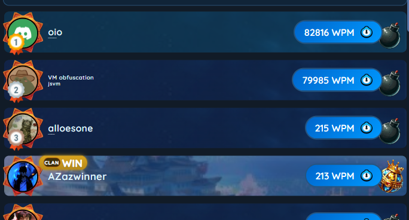
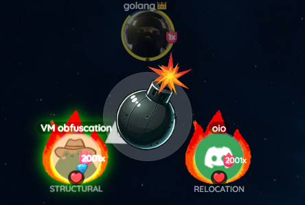

# What is this?
This is a reversal and bot created to automatically play the discord game `word bomb`, which can also be found at [wordbomb.io](https://wordbomb.io).

# Why?
I was tired of working on my ThreatMetrix solver API so I took a 1 day break to make this for fun.

# Config
Token is your bearer token, it's used in any request sent to `https://1266394578702041119.discordsays.com/.proxy/colyseus/`

HostDiscordID is the discord user ID of the host of the game you want to join.

Fast dictates how the bot will play. If it's true, it will send answers basically instantly. Otherwise, it will send them with a delay.

# HTTP Server
There's a localhost HTTP server at :8080/command, right now it's just used to send chat messages. `POST` with `{"command": 1, "message": "https://antibot.blog"}` and it will send a chat message.

# Known Issues
Sometimes when a host leaves the lobby, it will crash. 
If a game closes, it will crash.
If a game goes past 5000 rounds, it will crash (because the game closes).
If you close the program and instantly try to re-open it, it will crash because the server won't let you rejoin that fast.
It does not properly handle any errors. Leading to a lot of crashing.

# Showcase

# AI
The code in ./wordbomb/parser.go is AI generated. I'm just putting this here for clarity, so no one "calls me out" for using AI.